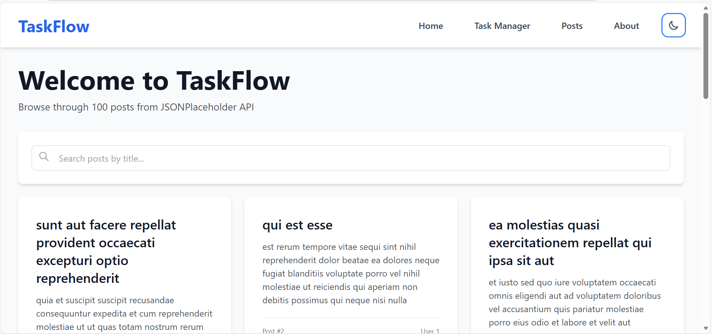
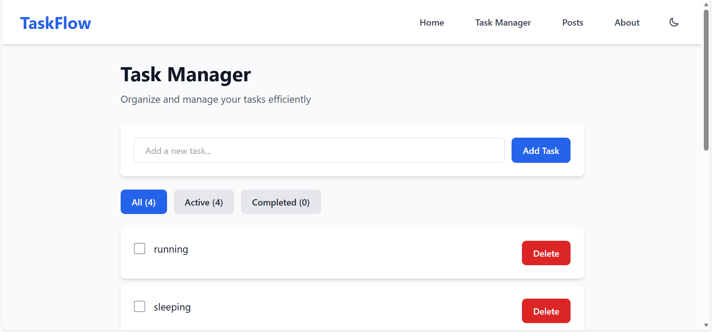
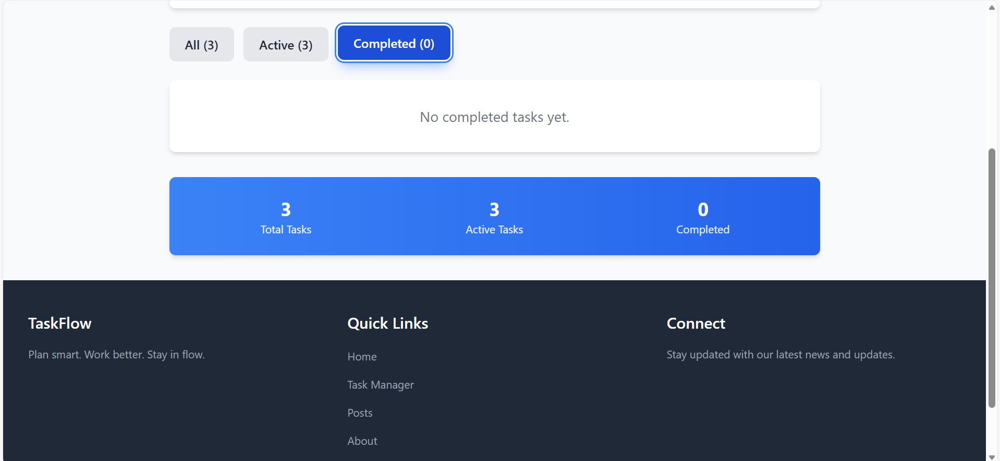
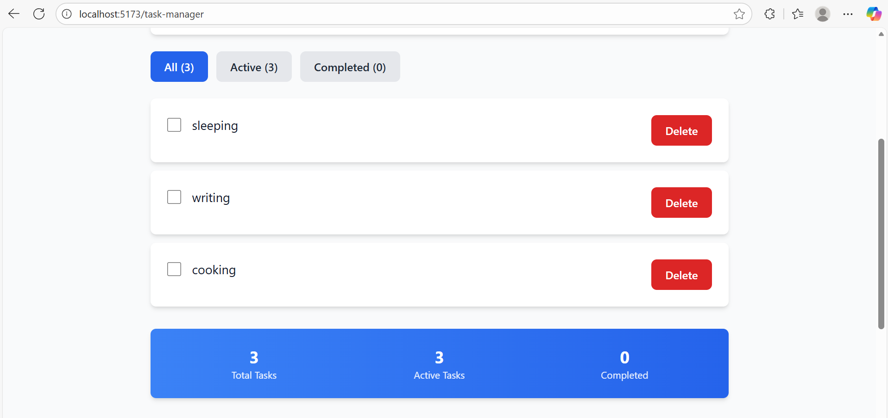
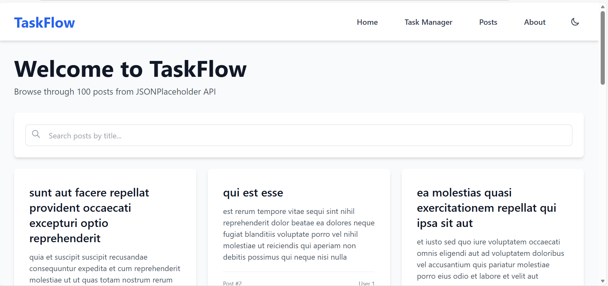
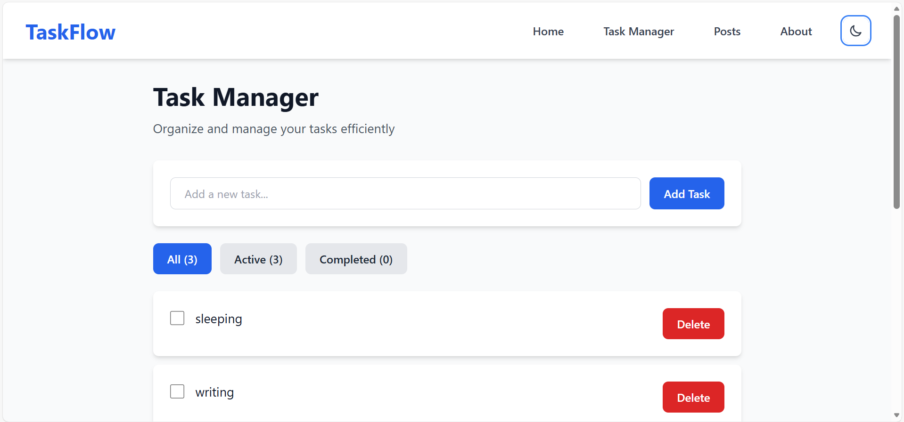
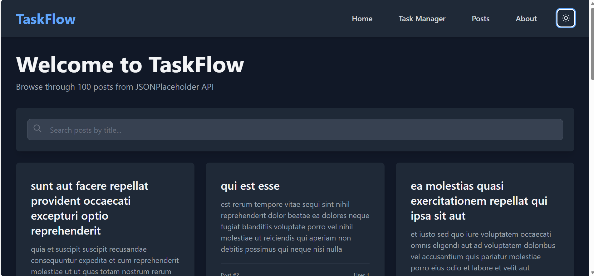
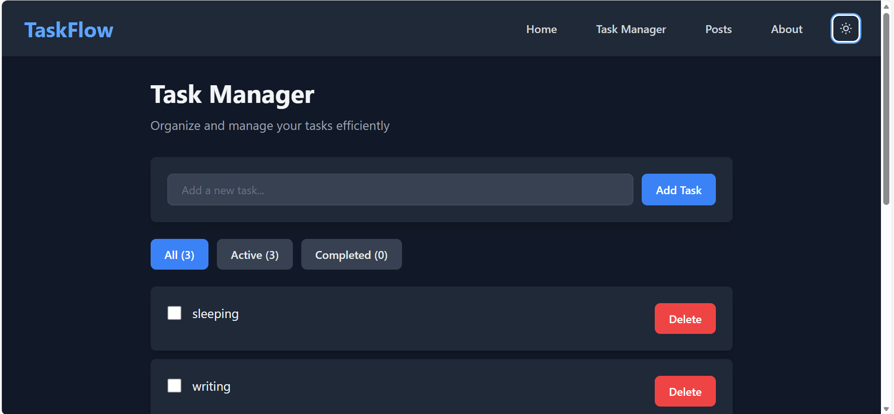

# TaskFlow

> Plan smart. Work better. Stay in flow.

A modern, full-featured React application for task management and productivity. Built with Vite, Tailwind CSS, and React Router, TaskFlow helps you organize your work efficiently with an intuitive interface and powerful features.

## 📋 Table of Contents

- [Overview](#overview)
- [Features](#features)
- [Installation](#installation)
- [Getting Started](#getting-started)
- [Project Structure](#project-structure)
- [Features in Detail](#features-in-detail)
- [Screenshots](#screenshots)
- [Deployment](#deployment)
- [Technologies Used](#technologies-used)
- [Available Scripts](#available-scripts)
- [Contributing](#contributing)
- [License](#license)

## 🎯 Overview

This project is a comprehensive React application that showcases modern front-end development practices. It includes a task management system, API integration with JSONPlaceholder, theme switching functionality, and a fully responsive design that works seamlessly across mobile, tablet, and desktop devices.

The application demonstrates:
- **Component-based architecture** with reusable UI components
- **State management** using React Hooks and Context API
- **API integration** with error handling and loading states
- **Responsive design** with Tailwind CSS
- **Dark mode** with system preference detection
- **Client-side routing** with React Router
- **Data persistence** using localStorage

## ✨ Features

### Core Features

- 🏠 **HomePage**: Displays API posts in a responsive grid layout with search and pagination
- ✅ **Task Manager**: Full CRUD functionality with filtering, completion tracking, and localStorage persistence
- 🌓 **Dark Mode**: System preference detection with manual toggle and persistent theme selection
- 📱 **Responsive Design**: Mobile-first approach with Tailwind CSS breakpoints
- 🎨 **Reusable Components**: Button, Card, Layout components with consistent styling
- 🔍 **Search & Filter**: Real-time search and filtering capabilities
- 💾 **Data Persistence**: LocalStorage integration for task management

### Interactive Features

- Smooth hover animations on buttons and cards
- Theme switcher with rotation animation
- Responsive navigation menu
- Pagination for large datasets
- Loading and error states
- Focus states for accessibility

## 🚀 Installation

### Prerequisites

Before you begin, ensure you have the following installed:
- **Node.js** (version 16.x or higher)
- **npm** (version 7.x or higher) or **yarn**

### Step 1: Clone the Repository

```bash
git clone <repository-url>
cd react-js-jsx-and-css-mastering-front-end-development-graceakhati-dev
```

### Step 2: Install Dependencies

Install all required dependencies using npm:

```bash
npm install
```

This will install all the packages listed in `package.json`, including:
- React and React DOM
- React Router DOM
- Axios
- Tailwind CSS
- Vite and related plugins

### Step 3: Verify Installation

After installation, verify that all dependencies are installed correctly:

```bash
npm list --depth=0
```

## 🏃 Getting Started

### Running the Development Server

Start the development server with:

```bash
npm run dev
```

The application will be available at:
- **Local**: `http://localhost:5173`
- **Network**: Check the terminal for the network URL (usually `http://192.168.x.x:5173`)

### First Time Setup

1. **Open your browser** and navigate to `http://localhost:5173`
2. **Wait for the app to load** - The HomePage will fetch posts from JSONPlaceholder API
3. **Explore the features**:
   - Navigate between pages using the navbar
   - Try adding tasks in the Task Manager
   - Toggle between light and dark themes
   - Test the search functionality on the HomePage

### Hot Module Replacement (HMR)

The development server includes Hot Module Replacement, which means:
- Changes to your code will automatically reload in the browser
- You don't need to manually refresh the page
- State is preserved during hot reloads

## 📁 Project Structure

```
react-js-jsx-and-css-mastering-front-end-development-graceakhati-dev/
├── public/                 # Static assets
├── screenshots/            # Application screenshots
├── src/
│   ├── components/        # Reusable UI components
│   │   ├── Button.jsx     # Button component with variants
│   │   ├── Card.jsx       # Card component for content display
│   │   ├── Footer.jsx      # Footer component
│   │   ├── Layout.jsx     # Layout wrapper (Navbar + Footer)
│   │   └── Navbar.jsx     # Navigation bar with theme toggle
│   ├── context/           # React Context providers
│   │   └── ThemeContext.jsx  # Theme management context
│   ├── hooks/             # Custom React hooks
│   │   └── useLocalStorage.js  # localStorage hook
│   ├── pages/             # Page-level components
│   │   ├── Home.jsx       # HomePage with API posts
│   │   ├── TaskManager.jsx # TaskManagerPage
│   │   ├── Posts.jsx      # Posts page
│   │   └── About.jsx      # AboutPage
│   ├── utils/             # Utility functions
│   ├── App.jsx            # Main app component with routing
│   ├── main.jsx           # Application entry point
│   └── index.css          # Global styles and Tailwind imports
├── .gitignore             # Git ignore file
├── index.html             # HTML template
├── package.json           # Dependencies and scripts
├── postcss.config.js      # PostCSS configuration
├── tailwind.config.js     # Tailwind CSS configuration
├── vite.config.js         # Vite configuration
└── README.md              # This file
```

### Directory Explanations

- **`src/components/`**: Reusable UI components that can be used across multiple pages
- **`src/pages/`**: Page-level components that represent different routes
- **`src/context/`**: React Context providers for global state management
- **`src/hooks/`**: Custom React hooks for reusable logic
- **`src/utils/`**: Helper functions and utilities

## 🔧 Features in Detail

### 1. Task Manager

A full-featured task management system with the following capabilities:

- **Add Tasks**: Create new tasks with a simple input form
- **Complete Tasks**: Mark tasks as completed with a checkbox
- **Delete Tasks**: Remove tasks from the list
- **Filter Tasks**: View All, Active, or Completed tasks
- **Persistence**: All tasks are automatically saved to localStorage
- **Statistics**: View total, active, and completed task counts

**Usage:**
1. Navigate to `/task-manager`
2. Type a task in the input field
3. Click "Add Task" or press Enter
4. Use checkboxes to mark tasks as complete
5. Use filter buttons to view different task categories
6. Click "Delete" to remove a task

### 2. API Integration

The HomePage integrates with JSONPlaceholder API to fetch and display posts:

- **Data Fetching**: Uses Axios to fetch posts from `https://jsonplaceholder.typicode.com/posts`
- **Loading States**: Shows a spinner while data is loading
- **Error Handling**: Displays error messages with retry functionality
- **Search Functionality**: Real-time search to filter posts by title
- **Pagination**: Displays 12 posts per page with navigation controls

**Usage:**
1. Navigate to the HomePage (`/`)
2. Posts are automatically loaded from the API
3. Use the search bar to filter posts by title
4. Navigate through pages using pagination controls

### 3. Theme Switcher

A comprehensive theme management system:

- **System Detection**: Automatically detects system preference on first visit
- **Manual Toggle**: Click the theme button in the navbar to switch themes
- **Persistence**: Theme preference is saved to localStorage
- **Smooth Transitions**: All theme changes are animated smoothly
- **Icon Animation**: Theme toggle icon rotates on hover

**Usage:**
1. Click the sun/moon icon in the navbar
2. The entire application switches between light and dark themes
3. Your preference is remembered for future visits

### 4. Responsive Design

The application is fully responsive and optimized for all screen sizes:

- **Mobile**: Optimized layout for screens < 640px
- **Tablet**: Enhanced layout for screens ≥ 640px
- **Desktop**: Full-featured layout for screens ≥ 1024px
- **Adaptive Typography**: Text sizes adjust based on screen size
- **Flexible Grids**: Grid layouts adapt to available space

## 📸 Screenshots

### HomePage - API Posts Display



*HomePage displaying posts from JSONPlaceholder API in a responsive grid layout with search functionality*

### Task Manager - CRUD Operations

#### Adding Tasks


*Adding a new task to the task manager*

#### Completing Tasks


*Tasks with completed status showing strikethrough and reduced opacity*

#### Deleting Tasks


*Deleting tasks from the task manager*

#### Filtering Tasks


*Filtering tasks by All, Active, or Completed status*

### Theme Modes

#### Light Theme

*HomePage in light mode*


*Task Manager in light mode*

#### Dark Theme

*HomePage in dark mode*


*Task Manager in dark mode*

### Mobile Responsive Views


*HomePage optimized for mobile devices*


*Task Manager optimized for mobile devices*


*Mobile navigation menu*

## 🚀 Deployment

### Deployment Options

This application can be deployed to various platforms. Here are instructions for the most popular options:

### Option 1: Deploy to Vercel (Recommended)

Vercel provides excellent support for Vite applications with zero configuration.

#### Step 1: Build the Application

```bash
npm run build
```

This creates an optimized production build in the `dist/` folder.

#### Step 2: Install Vercel CLI (Optional)

```bash
npm install -g vercel
```

#### Step 3: Deploy

**Using Vercel CLI:**
```bash
vercel
```

Follow the prompts to:
1. Log in or create a Vercel account
2. Link your project
3. Confirm deployment settings

**Using Vercel Dashboard:**
1. Go to [vercel.com](https://vercel.com)
2. Sign up or log in
3. Click "New Project"
4. Import your Git repository
5. Vercel will auto-detect Vite settings
6. Click "Deploy"

#### Step 4: Configure Build Settings

Vercel should auto-detect these settings:
- **Framework Preset**: Vite
- **Build Command**: `npm run build`
- **Output Directory**: `dist`
- **Install Command**: `npm install`

#### Step 5: Environment Variables

If you add environment variables later, add them in the Vercel dashboard under Project Settings → Environment Variables.

### Option 2: Deploy to Netlify

Netlify also provides excellent support for Vite applications.

#### Step 1: Build the Application

```bash
npm run build
```

#### Step 2: Install Netlify CLI (Optional)

```bash
npm install -g netlify-cli
```

#### Step 3: Deploy

**Using Netlify CLI:**
```bash
netlify deploy --prod
```

**Using Netlify Dashboard:**
1. Go to [netlify.com](https://netlify.com)
2. Sign up or log in
3. Click "Add new site" → "Import an existing project"
4. Connect your Git repository
5. Configure build settings:
   - **Build command**: `npm run build`
   - **Publish directory**: `dist`
6. Click "Deploy site"

#### Step 4: Create `netlify.toml` (Optional)

Create a `netlify.toml` file in the project root:

```toml
[build]
  command = "npm run build"
  publish = "dist"

[[redirects]]
  from = "/*"
  to = "/index.html"
  status = 200
```

### Option 3: Deploy to GitHub Pages

#### Step 1: Install gh-pages

```bash
npm install --save-dev gh-pages
```

#### Step 2: Update package.json

Add these scripts to `package.json`:

```json
{
  "scripts": {
    "predeploy": "npm run build",
    "deploy": "gh-pages -d dist"
  }
}
```

#### Step 3: Update vite.config.js

```javascript
export default defineConfig({
  plugins: [react()],
  base: '/your-repo-name/', // Replace with your repository name
})
```

#### Step 4: Deploy

```bash
npm run deploy
```

### Deployed Application URL

Once deployed, your application will be available at:

**Vercel**: `https://your-project-name.vercel.app`

**Netlify**: `https://your-project-name.netlify.app`

**GitHub Pages**: `https://your-username.github.io/your-repo-name/`

> 📝 **Note**: Replace the placeholder URLs above with your actual deployed application URL after deployment.

## 🛠 Technologies Used

### Core Technologies

- **[React 18](https://react.dev/)** - Modern UI library with hooks and functional components
- **[Vite](https://vitejs.dev/)** - Fast build tool and development server
- **[React Router DOM](https://reactrouter.com/)** - Declarative routing for React applications

### Styling

- **[Tailwind CSS](https://tailwindcss.com/)** - Utility-first CSS framework with dark mode support
- **[PostCSS](https://postcss.org/)** - CSS processing tool
- **[Autoprefixer](https://github.com/postcss/autoprefixer)** - Automatic vendor prefixing

### HTTP Client

- **[Axios](https://axios-http.com/)** - Promise-based HTTP client for API requests

### State Management

- **React Context API** - Theme management
- **React Hooks** - useState, useEffect, useContext
- **Custom Hooks** - useLocalStorage for data persistence

## 📜 Available Scripts

In the project directory, you can run:

### `npm run dev`

Starts the development server. The app will reload when you make changes.

### `npm run build`

Builds the app for production to the `dist/` folder. The build is optimized and minified for best performance.

### `npm run preview`

Preview the production build locally. This requires running `npm run build` first.

### `npm install`

Installs all project dependencies listed in `package.json`.

## 🎨 Design Features

### Animations & Transitions

- **Button Hover Effects**: Lift animation with shadow
- **Card Hover Effects**: Scale and shadow transitions
- **Theme Switcher**: Smooth rotation animation
- **Navigation Links**: Scale and background color transitions
- **Form Inputs**: Border color transitions on focus/hover

### Responsive Breakpoints

- **Mobile**: < 640px (default styles)
- **Tablet**: ≥ 640px (`sm:` prefix)
- **Desktop**: ≥ 1024px (`lg:` prefix)
- **Large Desktop**: ≥ 1280px (`xl:` prefix)

### Color Schemes

- **Light Theme**: White backgrounds with gray text
- **Dark Theme**: Dark gray backgrounds with light text
- **Accent Colors**: Blue for primary actions, Red for danger actions

## 🤝 Contributing

This is a learning project demonstrating React front-end development skills. Contributions and suggestions are welcome!

### How to Contribute

1. Fork the repository
2. Create a feature branch (`git checkout -b feature/amazing-feature`)
3. Commit your changes (`git commit -m 'Add some amazing feature'`)
4. Push to the branch (`git push origin feature/amazing-feature`)
5. Open a Pull Request

## 📝 License

This project is created for educational purposes.

## 🙏 Acknowledgments

- [JSONPlaceholder](https://jsonplaceholder.typicode.com/) for providing the fake REST API
- [Tailwind CSS](https://tailwindcss.com/) for the utility-first CSS framework
- [React](https://react.dev/) team for the amazing library
- [Vite](https://vitejs.dev/) team for the fast build tool

## 📞 Support

If you encounter any issues or have questions:

1. Check the [Issues](https://github.com/your-username/your-repo/issues) page
2. Create a new issue with detailed information
3. Include steps to reproduce the problem

---

**Built with ❤️ using React, Vite, and Tailwind CSS**
